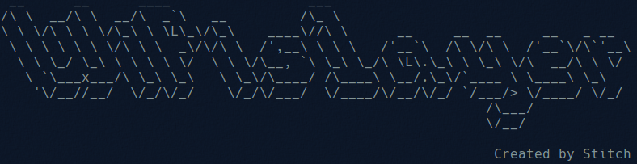

# WifiSlayer v1.0
WifiSlayer is a wifi hacking tool that allows you to perform various functions from a single interface.

# Current version features

## Start monitor mode:
This option displays the available interfaces and allows the user to select one to start monitor mode on it. The "airmon-ng start" command is used to start monitor mode on the selected interface and kill any process that may interfere with it.

## Stop monitor mode:
This option displays the interfaces in monitor mode available and allows the user to select one to stop monitor mode on it. The "airmon-ng stop" command is used to stop monitor mode on the selected interface.

## Scan Networks:
This option displays the interfaces in monitor mode available and allows the user to select one to scan the nearby wireless networks. Therefore, a specific network interface can be chosen and scan the available WiFi access points through that interface, getting detailed information about each. The result of the scan performed can be saved in a pcap file or not.

## Scan target ESSID:
This option allows the user to scan a specific wireless network (ESSID) for additional information about a particular access point (AP). The user must provide the BSSID (also known as the MAC address of the AP) of the target network and the interface/channel on which it is located, to put it in monitor mode and perform the scan.
	
## Deauth attack:
This option allows the user to launch a deauthentication attack on devices connected to a selected wireless network. The user must provide the BSSID of the target network, the monitor mode interface, and the MAC address of the target device.

## Evil Twin captive portal:
This option allows the user to launch an "Evil Twin" attack on a selected wireless network. The attack creates a fake access point or WiFi network with the same name and appearance as an organization's legitimate network and displays a fake login page (captive portal) to collect user credentials. The user must provide the SSID name that will be used for the fake access point and the interface that will be used for it.

